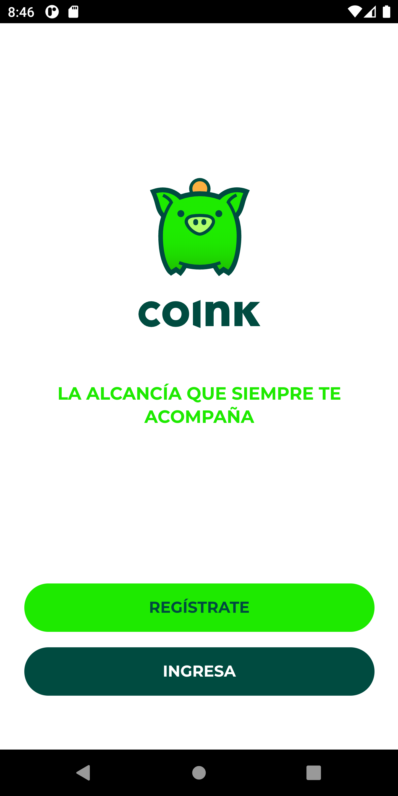
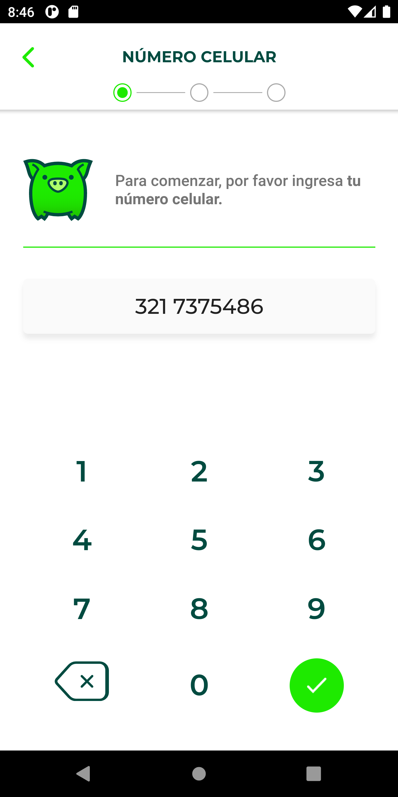
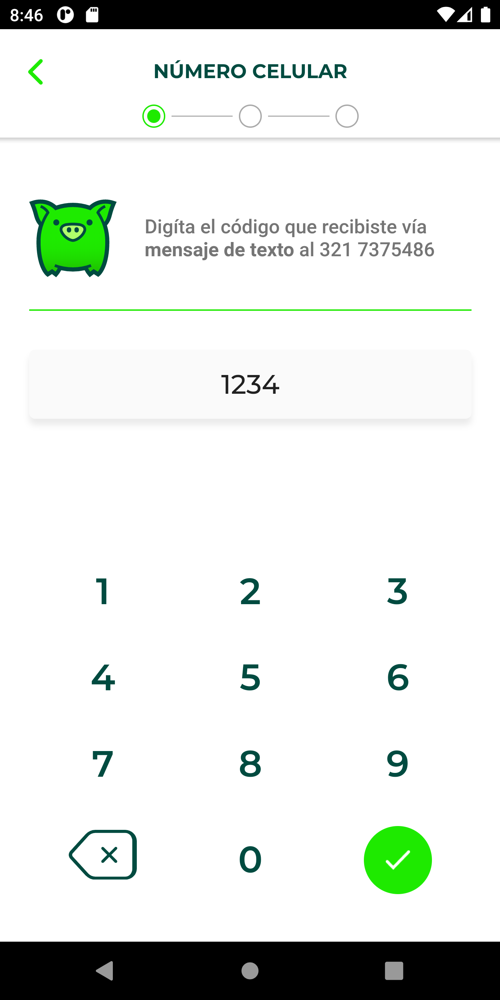
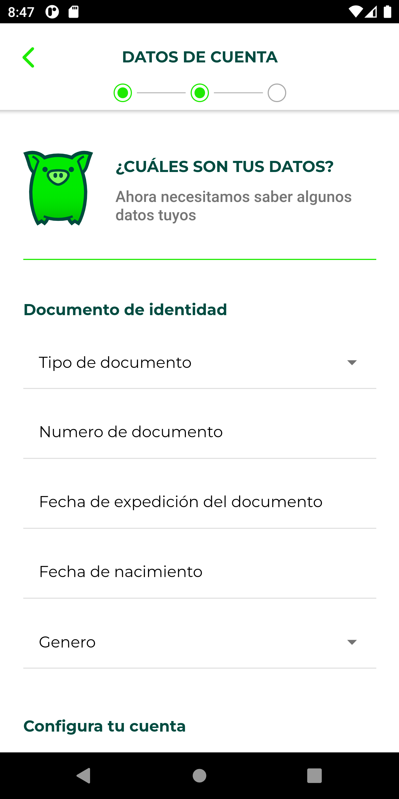
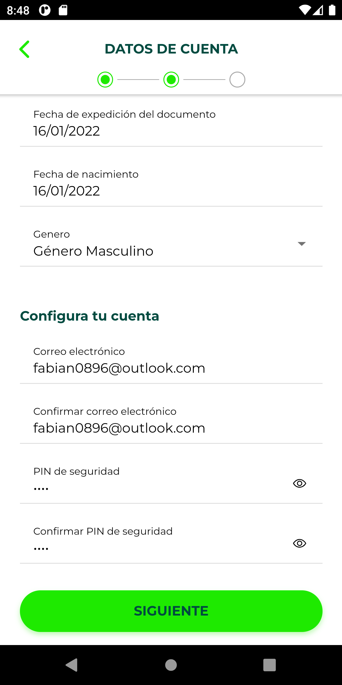
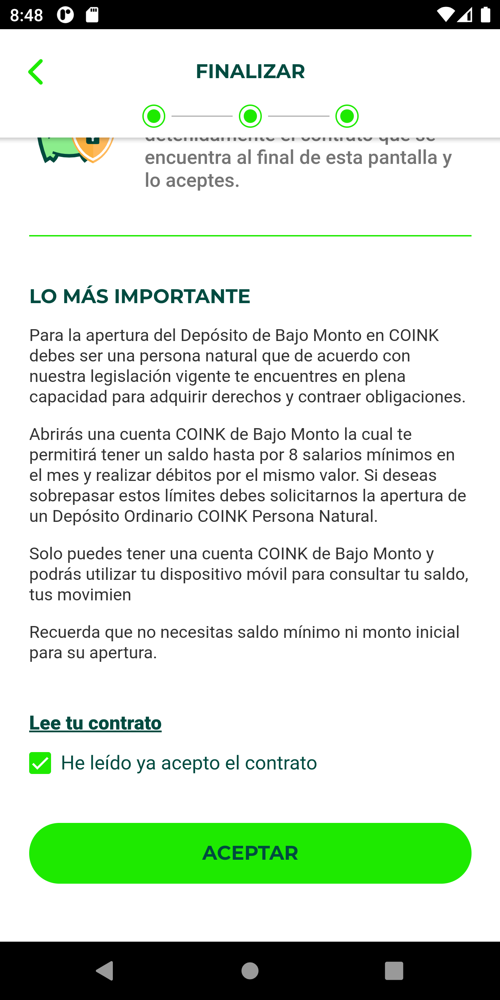
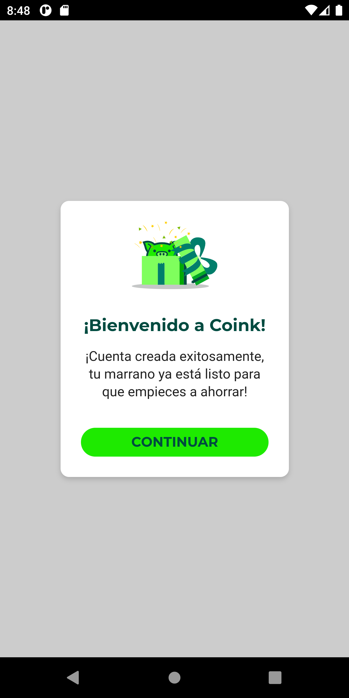
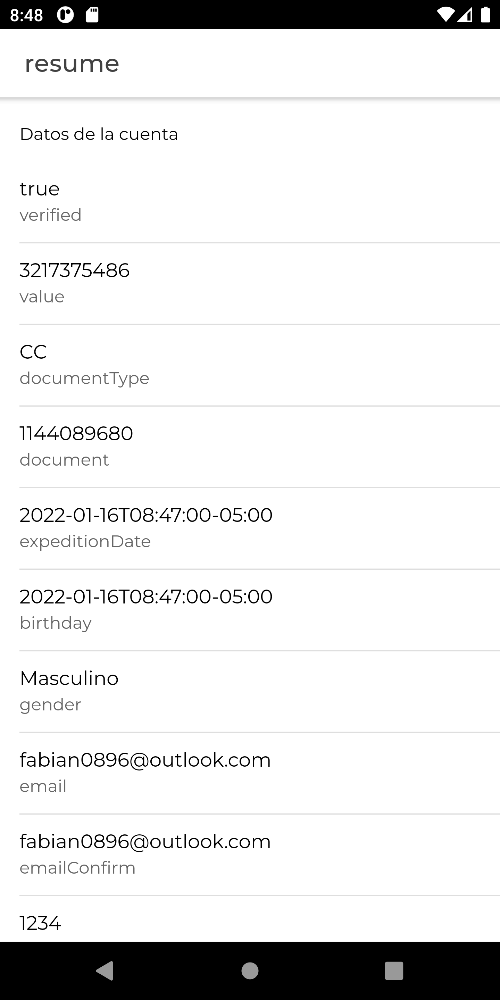

# Coink Login

This is a simple login flow for the coink app.

to run this app in a local enviroment you can run

```
ionic serve
```

this command rund a local server in port 8200.

## How to use.

### 1. Login Screen

in this page we can select beetwen register or login but only is implemented the register flow.



### 2. Phone Number Screen

in this screen we have to introduce our phone number and then press the "OK" button. When the button is pressed the coinck service is called.



### 3. Code Verification.

After coink service is called you have yo provide a verification code. In real life this code is send to your phone but in this implementation is hardcoded. The correct code to cotinue the flow is. **1234**

**Correct verification code:** 1234



### 4. Account information

In this screen we have to introduce the missing data. If you put something wrong an error message below the text field is going display the error.



When you have filled all the data you can go to the next screen.



### 5. Accept Terms and Conditions

As the last step you have to accept the terms and conditions to continue the flow. Once you accept a success modal will appear and then you can se the resume of the data.






